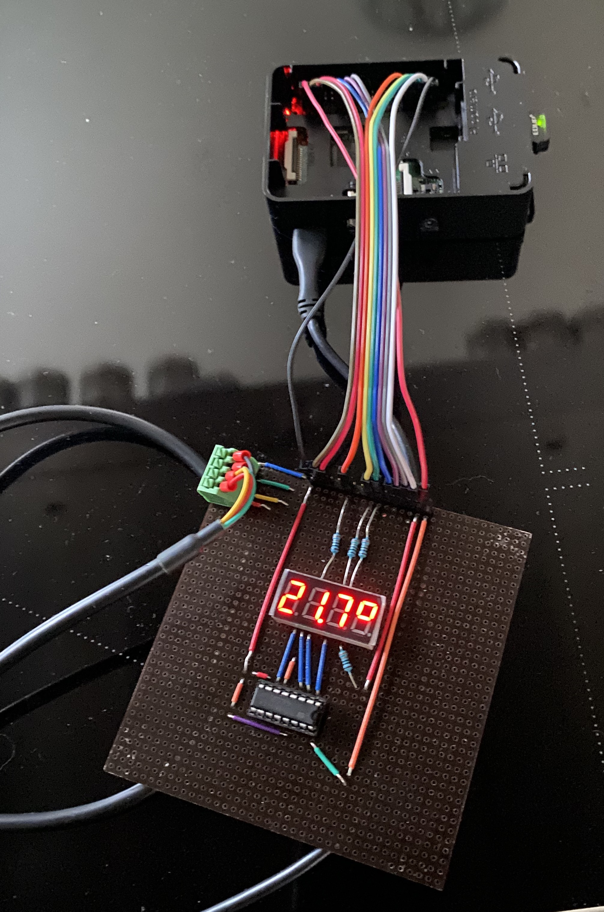
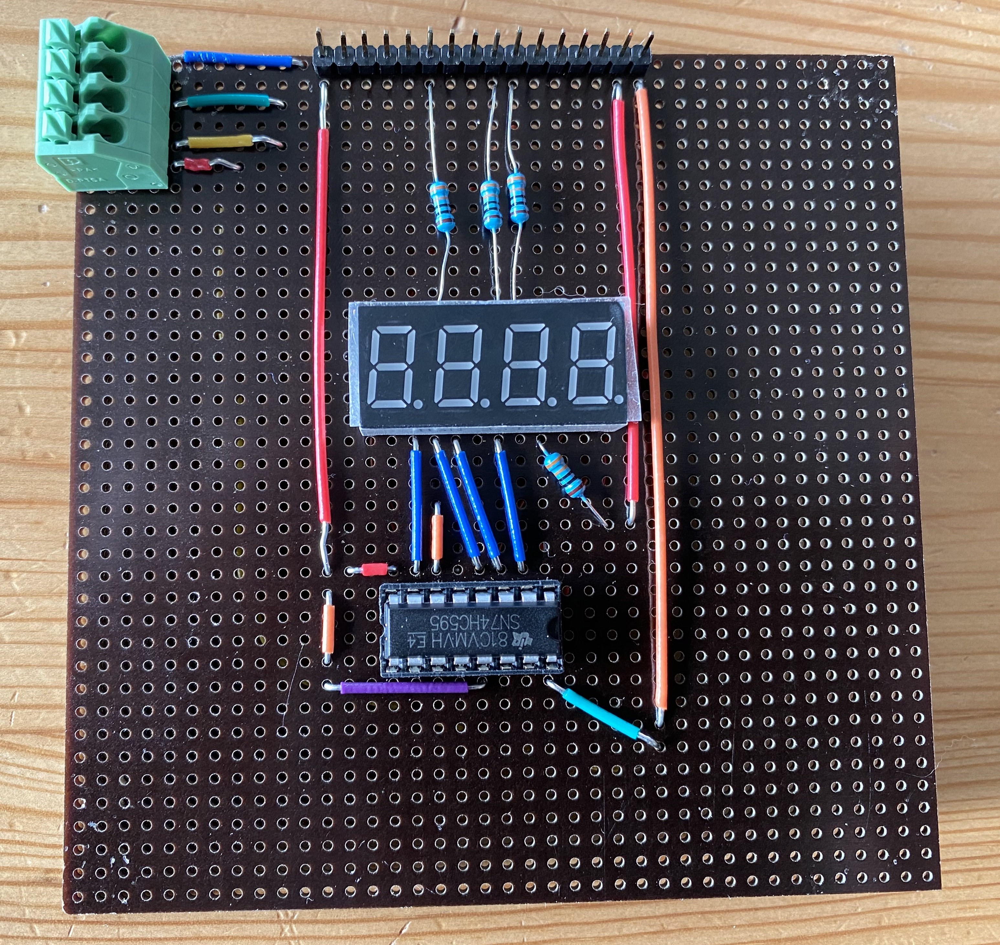
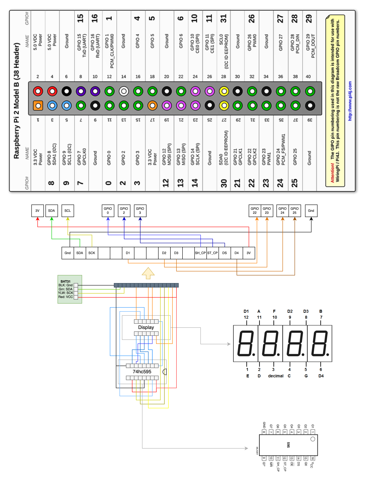

# Grow Controller

## Quick Overview

The Grow Controller uses a Raspberry Pi to run a custom-built board with a temperature and humidity sensor. It sits by your tent, and the sensor connects inside. This means you can easily glance at the display on the board to check the temperature and humidity readings without needing to unzip the tent or disrupt your setup.

I chose a Raspberry Pi over an Arduino because it lets me have a Database and Webserver all in one. Plus, it comes with a small WiFi dongle, so you can reach its webserver anywhere in your house.

## Board

**Components:**

- SHT31 temperature and humidity sensor with cable
- 7-segment 4-digit display: used for showcasing temperature and humidity readings.
- 74HC595 shift register: manages the display, reducing the number of wires needed to connect to the Raspberry Pi.
- Pin headers: enable the connection to the GPIO pins of the Raspberry Pi.
- 4-port PCB terminal: designed for connecting the sensor cable.
- Connection wires
- 4 330 Ohm resistors for the D1, D2, D3, D4 pins of the display. They go straight into the Raspi

**Wiring**

