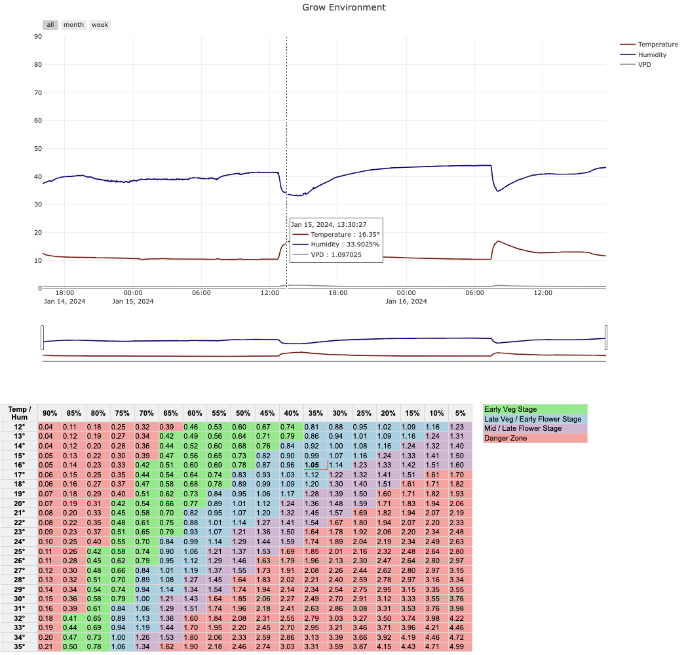

The webserver displays a history of recorded temperature and humidity values, which have been stored in the SQLite database by the C-program. Moreover, it presents the corresponding Vapor Pressure Deficit (VPD) value in the table below, revealing this information by hovering over a specific point in time on the graph.

The application was developed using a very simple Node.js app, incorporating the plotly.js graph library for visualization.

